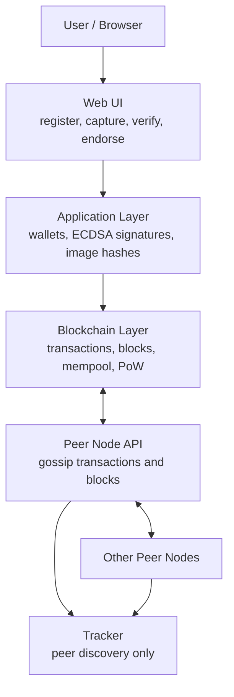

# TrueShot

Imagine you see a photo online showing a major news event. It looks real. People
are sharing it, commenting on it, and maybe even making decisions based on it.

But here's the problem: with AI and editing tools today, looking real does not
mean it is real. So the real question is not just, "Does this photo look real?"
The question is: where did it come from, who signed it, and has it been changed?

TrueShot is a peer-to-peer photo provenance prototype. A device signs a photo
capture, the network records that claim on a small proof-of-work blockchain, and
anyone can later upload an image to check whether it matches an on-chain record.

## Architecture



## How It Works

TrueShot does not try to decide whether the scene inside a photo is true. It
proves a narrower, cryptographic claim: this image data was signed by this
device at this time, and the recorded bytes have not changed.

The application layer creates four kinds of signed records:

| Record | Purpose |
|---|---|
| `REGISTER` | Bind a device ID to a public key. |
| `CAPTURE` | Record an image SHA-256 hash, pHash, location, and device signature. |
| `ENDORSE` | Let another device vouch for an existing capture. |
| `REVOKE` | Mark a device as no longer trusted. |

Each peer keeps a local blockchain. New transactions enter the mempool, miners
pack pending transactions into blocks, and peers gossip accepted transactions
and blocks to each other. The tracker only helps peers discover each other; it
does not store the chain.

Verification uses two image fingerprints:

| Result | Condition | Meaning |
|---|---|---|
| `AUTHENTIC` | SHA-256 exact match | The uploaded image exactly matches a signed capture. |
| `SUSPICIOUS` | pHash match with changed bytes, or invalid provenance | The image is probably a modified version of a known capture, or the capture record cannot be fully trusted. |
| `UNKNOWN` | No hash or pHash match | The network has no record for this image. |

For deeper design notes, see [DESIGN.md](./DESIGN.md).

## Setup

Use Python 3. Run these commands from the project root:

```bash
python3 -m venv .venv
source .venv/bin/activate
python3 -m pip install -r requirements.txt pytest
```

## Run Locally

Start the tracker in one terminal:

```bash
python3 run_tracker.py --port 5000
```

Start one peer in another terminal:

```bash
python3 run_peer.py --tracker-url http://127.0.0.1:5000 --web-port 8001
```

Open the web UI:

```text
http://127.0.0.1:8001
```

To run a small local network, start more peers on different ports:

```bash
python3 run_peer.py --tracker-url http://127.0.0.1:5000 --web-port 8002
python3 run_peer.py --tracker-url http://127.0.0.1:5000 --web-port 8003
```

You can also launch one tracker and three peers with:

```bash
python3 demo.py
```

## Share a Local Demo

For someone else on the same Wi-Fi or LAN, find your Mac's local IP address:

```bash
ipconfig getifaddr en0
```

If that prints `192.168.1.23`, share this peer UI link:

```text
http://192.168.1.23:8001
```

The Flask servers already listen on `0.0.0.0`, so other devices on the same
network can open the UI as long as your firewall allows incoming connections.

For a public internet link, expose the peer UI port with a tunnel tool. For
example, if you already have ngrok installed:

```bash
ngrok http 8001
```

Then share the HTTPS forwarding URL printed by ngrok.

## Basic Workflow

1. Open a peer UI, for example `http://127.0.0.1:8001`.
2. Register the device.
3. Capture a photo by uploading an image.
4. Wait for the peer to mine the pending transaction into a block.
5. Verify the original image or a modified copy.
6. Inspect blocks and transactions in the explorer.

## Test

Run all tests:

```bash
python3 -m pytest tests -v
```

Run one test file:

```bash
python3 -m pytest tests/test_blockchain.py -v
python3 -m pytest tests/test_network.py -v
python3 -m pytest tests/test_application.py -v
python3 -m pytest tests/test_web.py -v
```

## Attack Demos

The attack scripts are for authorized local testing of this prototype. They are
meant to demonstrate security limits in the current design, not to be used
against systems you do not own.

Run commands from the project root after starting a tracker and at least one
peer.

Full chain replacement:

```bash
python3 attacks/attack_fake_chain.py \
  --tracker http://127.0.0.1:5000 \
  --attacker-ip 127.0.0.1 \
  --serve-port 9997 \
  --blocks 30
```

Tracker poisoning:

```bash
python3 attacks/attack_tracker_poison.py \
  --tracker http://127.0.0.1:5000 \
  --attacker-url http://127.0.0.1:9999 \
  --serve-port 9999 \
  --chain-length 30
```

Photo tampering test:

```bash
python3 attacks/attack_tamper_photo.py \
  --target http://127.0.0.1:8001 \
  --image path/to/photo.jpg
```

Mempool flooding:

```bash
python3 attacks/attack_flood_mempool.py \
  --target http://127.0.0.1:8001 \
  --count 5000 \
  --threads 20
```

Gossip sender URL spoofing:

```bash
python3 attacks/attack_gossip_hijack.py \
  --target http://127.0.0.1:8001 \
  --attacker-url http://127.0.0.1:9999 \
  --serve-port 9999 \
  --chain-length 25
```

For a detailed security report, see [attacks/README.md](./attacks/README.md).

## Project Layout

```text
application/   Wallets, signatures, image hashing, capture and verification logic
blockchain/    Transactions, blocks, Merkle roots, mining, chain validation
network/       Tracker, peer API, gossip, synchronization
web/           Flask web UI and peer HTTP routes
attacks/       Security demonstration scripts
tests/         Unit and integration tests
```
